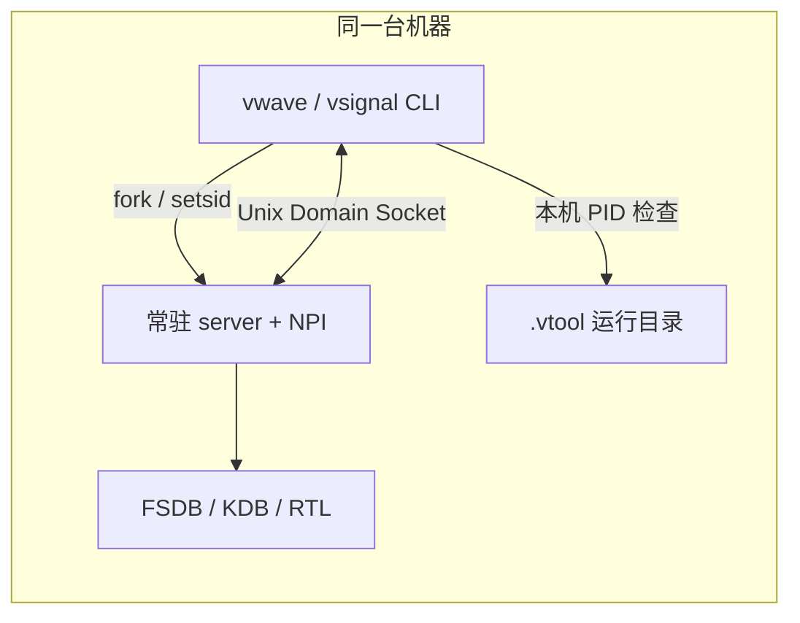
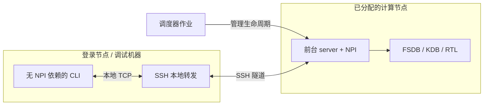

# tool_wave v1.6：计算集群下 server 与查询端分离部署分析

日期：2026-10-09
基线：`VERSION=1.6`，提交 `0a3a6c9`
范围：vwave / vsignal 的通信、服务发现、进程管理、运行依赖与集群部署方式。

## 1. 结论

当前版本要求查询进程和 server 在同一台机器上，且能访问同一套运行目录与 Unix Domain Socket（UDS）。共享 FSDB、KDB 或 `.vtool` 目录不能解除这个限制。

限制不仅在通信方式，还涉及以下几处单机假设：

1. 查询前用本机 `kill(pid, 0)` 判断服务是否存活，PID 没有主机信息。
2. `open` 在当前机器 fork server；`close` 失败后会按运行目录里的 PID 在当前机器强制杀进程。
3. 服务发现依赖当前工作目录，运行文件不区分主机与会话。
4. 查询和 server 编译进同一个二进制，查询机器也必须具备可加载的 Verdi 动态库。
5. daemon 脱离终端，但不能脱离集群作业的资源分配和回收规则。

**建议保留本地 UDS 模式，新增独立前台 server、无 NPI 依赖的查询端和明确的远程连接入口。** 通信增加 TCP；默认通过 SSH 隧道访问计算节点的回环监听，需要节点直连时再启用受认证保护的集群地址监听。初期由用户或调度脚本在计算节点启动 server，查询端负责连接已有服务。

短期不修改程序也可以通过 SSH 在 server 所在节点执行现有查询 CLI。此时命令由远端发起，但实际查询进程仍与 server 同机，可作为过渡方式。

## 2. 当前实现与直接证据

| 环节 | 当前实现 | 源码位置 |
|---|---|---|
| 客户端连接 | `AF_UNIX`、`sockaddr_un`，只接收 socket 文件路径 | [client.h](../src_common/client.h)，`send_request()`，第 51 行 |
| 服务端监听 | `AF_UNIX`，socket 权限设为 `0600` | [server_loop.h](../src_common/server_loop.h)，`create_and_run_loop()`，第 143 行 |
| 服务存活判断 | 读取 PID 文件，然后本机执行 `kill(pid, 0)` | [run_dir.h](../src_common/run_dir.h)，`is_server_alive()`，第 146 行 |
| 自动发现 | 从 CWD 向上寻找 `.vtool/<tool_run>`，再检查本机 PID | 同上，`auto_detect()`，第 157 行 |
| 启动 | `fork()` → `setsid()` → 切换目录 → 加载数据库 → 探测本地 socket | [daemon.h](../src_common/daemon.h)，`fork_and_wait()`，第 42 行 |
| 停止 | 先发 `shutdown`，等待约 3 秒；仍存活则本机 `SIGKILL` | 同上，`shutdown_server()`，第 142 行 |
| 查询入口 | 发请求前必须通过 `is_server_alive()` | [vwave/main.cpp](../src_vwave/main.cpp)，第 276 行；[vsignal/main.cpp](../src_vsignal/main.cpp)，第 238 行 |
| 数据加载 | NPI 初始化和 FSDB / KDB 加载在 listener 创建之前完成 | [vwave server](../src_vwave/server/server_core.h)，第 84 行；[vsignal server](../src_vsignal/server/server_core.h)，第 82 行 |
| 二进制依赖 | 两个 main 都包含 server 代码，统一链接 `-lNPI -lnpiL1` | [Makefile](../Makefile) 与两个 `main.cpp` |

当前结构如下：



server 与 client 的代码已有一定分层，共享通信、运行目录、daemon 逻辑位于 `src_common`。查询 handler 通过 JSON 请求分发，适合复用；主要改动应集中在公共连接层、生命周期和构建入口。

## 3. 为什么集群场景会出问题

### 3.1 共享文件系统只能共享数据，不能共享 UDS 连接

假设 server 在 `compute01`，查询端在 `login01`，两边都能看到 `/shared/project/run/.vtool/wave_run/wave_server.sock`。

这个路径对应的监听端点属于 `compute01` 的内核。`login01` 看到文件，并不意味着能连接 `compute01` 的 socket；具体共享文件系统也可能不支持创建 socket。改 `--run-dir` 或把运行目录放到 NFS 上都不能实现跨节点通信。

FSDB / KDB 可以位于共享存储，也可以仅位于计算节点本地磁盘。只要 server 能访问数据，查询端理论上只需要传信号名、时间和查询参数，不需要访问完整数据库。

### 3.2 跨节点 PID 判断会产生误判和误操作

运行目录只存 PID 数字，例如 `12345`。这个数字只在 server 所在主机的 PID 命名空间中有意义。

| 查询机器上的情况 | 当前行为 | 后果 |
|---|---|---|
| 没有 PID 12345 | 判定 server 不存活 | 远端服务运行正常，查询仍被拒绝 |
| 有同号进程且可探测 | 判定 server 存活 | 通过前置检查，但连接本机 UDS 仍失败 |
| 运行 `open` 且判断“不存活” | 调用 `cleanup()` 后尝试本机启动 | 可能删除共享目录中远端服务的 PID、socket、source_info |
| 本机同号进程可探测，进入切换或关闭流程 | shutdown 无法跨机送达，随后可能执行本机 `SIGKILL` | 若权限允许，可能杀掉本机无关进程 |

第三、四种情况有具体触发条件，并不是所有跨节点查询都会发生。根本问题是当前生命周期管理把“能读到运行文件”等同于“这是本机服务”。即使同机，PID 复用也不能靠单个数字完整识别服务。

### 3.3 查询端 `--run-dir` 已有缺口

这是当前源码直接可见的问题，需要在分离部署前解决：

- vwave：`resolve_run_dir()` 只有同时提供 `--fsdb` 时才使用 `run_dir_override`；单独传 `--run-dir` 仍走 CWD 自动发现。
- vsignal：`resolve_run_dir()` 的参数写成 `/*run_dir_override*/`，查询、status、close 都没有使用这个覆盖值。
- 两者的 `open` 会使用覆盖目录，因此可能出现“能启动到指定目录，却不能用同一参数查询”的情况。
- 覆盖目录没有统一转成绝对路径；daemon 会先 `chdir(run_dir)`，再使用原来的目录字符串打开日志和创建 socket。相对覆盖路径可能被再次拼接，导致路径错误。

所以即使先采用 SSH 方式，也不能假定 `--run-dir` 已经支持任意位置连接。当前过渡方式应保持查询 CWD 与服务发现目录一致。

### 3.4 查询机器也依赖 Verdi 动态库

`src_common/client.h` 本身不依赖 NPI，但最终发布的 `vwave` / `vsignal` 包含 server 代码并链接 Verdi 库。Linux 动态加载器在执行 CLI 入口前就需要解析这些依赖，不能因为当前命令只做查询就跳过。

本次用 `readelf -d` 检查现有 `release/bin/vwave` 与 `release/bin/vsignal`，两者均包含：

```text
NEEDED: libNPI.so
NEEDED: libnpiL1.so
RPATH:  /opt/Synopsys/verdi/Y-2026.03-SP2/share/NPI/lib/linux64
```

因此仅增加 TCP 参数，查询机器仍可能因缺少 Verdi 库而无法运行。应把 NPI 动态库和数据库访问依赖留在 server 侧。查询命令没有调用 `npi_init()`，不能据此说每次查询都会签出 License；动态库依赖和 License 签出是两回事。

### 3.5 daemon 生命周期不适合直接作为批作业主体

当前 `open` 在父进程确认就绪后退出，server 在后台继续运行。对普通单机终端很方便，但集群调度器通常按作业或 step 管理进程、内存和时间限制。

如果批作业脚本只执行 `vwave open ...` 然后结束，后台 server 是否保留取决于集群的进程回收配置；`setsid()` 不能保证其继续运行。节点被回收、作业超时或抢占时，也可能只留下过期运行文件。

集群应运行前台 server，让它成为受调度器管理的长期任务。启动等待时间还应区分排队、数据库加载和查询等待；当前 `open` 默认 30 秒只覆盖本地启动，不代表作业排队超时。

## 4. 部署方式比较

| 方式 | 是否改程序 | 查询进程位置 | 优点 | 限制与定位 |
|---|---|---|---|---|
| SSH 执行现有 CLI | 不需要 | server 节点 | 最快使用；不改变协议 | 节点允许 SSH 才可用；远端仍需 Verdi 和正确 CWD；适合过渡 |
| SSH 转发现有 UDS | 需要处理发现与存活检查 | 查询机器 | 可保留 server UDS | 当前本机 PID 检查仍会阻止查询，查询二进制仍依赖 NPI；不是单靠转发就可用 |
| TCP + SSH 隧道 | 需要 | 查询机器 | 明确分离；server 可只监听回环；复用 SSH 身份认证 | 需要节点或跳板可达；隧道生命周期由调用方管理；推荐首个正式远程模式 |
| 集群内 TCP 直连 | 需要 | 查询机器 | 脚本集成方便，无每次 SSH 进程开销 | 需要网络放行、认证与会话定位；适合已有节点互通的集群 |

建议先提供通用 TCP 连接能力与前台 server，默认以 SSH 隧道部署。这样本地、SSH 和节点直连可以共享查询协议，不必为每个调度器重写业务查询。

当前版本的过渡示例，假设 `compute01` 上已有服务，且相应资源分配仍有效：

```bash
ssh compute01 'cd /shared/project/run1 && vwave get -s tb_top.clk -t 500000 --json'
ssh compute01 'cd /shared/project/run1 && vsignal driver top.data_out --json'
```

远端需预先配置工具路径与 Verdi 环境；非交互 SSH 不一定加载交互 shell 的 module 配置。这里仅展示调用方式，本次没有执行远端命令或提交集群作业。

## 5. 建议的最小改造方案

### 5.1 分开查询连接与 server 启动

保留用户熟悉的 `vwave` / `vsignal` 查询命令，增加 `vwave-server` / `vsignal-server` 前台入口。

- 查询二进制只包含参数解析、请求构建、连接与输出，不链接 NPI。
- server 二进制包含 NPI 初始化、数据加载、监听与查询 handler。
- 本地 `open` 可启动配套 server 并等待就绪，保留当前使用习惯。
- 远程模式首先支持连接已启动 server；数据加载由计算节点上的 server 启动参数指定。
- 远程 `open` 暂不承诺自动 SSH、排队、上传文件或切换数据库；调度脚本负责启动即可。

第一阶段仍采用“一进程加载一个 FSDB 或一个设计”。多个数据源使用独立 server / 会话，不引入集中式多租户服务。

### 5.2 独立表示连接地址和会话身份

运行目录负责 server 本地日志和运行文件，连接配置负责告诉查询端去哪里连接。新增 `--endpoint` 或 `--server-file`，不再借助 `--fsdb` 选择远程服务。

建议明确优先级：显式 `--endpoint` / `--server-file` 优先；未指定远程入口时才使用本地 `--run-dir` 和 CWD 自动发现。冲突参数应报错，不静默连接别的服务。

`server-file` 示例，以下字段与参数均为设计建议，当前版本尚未实现：

```json
{
  "schema_version": 1,
  "protocol_version": 1,
  "tool": "vwave",
  "session_id": "wave-run1-<random-id>",
  "host": "compute01",
  "endpoint": "tcp://compute01:43017",
  "state": "ready",
  "pid": 12345,
  "job_id": "987654",
  "source": "/scratch/run1/tb_top.fsdb"
}
```

其中 `pid` 和 `job_id` 用于诊断，不能授权查询机器执行本机 kill。连接后握手检查工具类型、协议版本、会话 ID 和实际数据源，防止节点重用、端口复用后查到另一个任务。

server 文件可以在共享目录中发布，也可以通过 SSH 获取；正常查询只需要网络连接，不要求共享文件系统。回环监听时发布的是节点本地地址，SSH 隧道使用查询端的本地转发地址连接，并仍验证相同会话身份。

### 5.3 存活判断改为连接探测，停止由服务所属节点执行

远程查询不读取 PID 判断存活，直接连接目标并发送握手或 status。连接失败应说明是地址不可达、连接拒绝、等待超时还是会话不匹配。

远程 `close` 发送协议 shutdown 并等待确认；无法确认时返回失败，保留诊断信息。不要在查询机器执行远端 PID 的 kill，也不要因为一次网络失败就删除 server 的运行文件。必要的强制终止通过 server 节点或对应调度作业处理。

本地模式也应先验证服务身份再终止。清理时确认运行文件仍属于当前 session，避免旧进程退出时删除新服务的元数据。

### 5.4 运行目录按会话隔离

建议分成两部分：

- 节点本地目录：UDS、PID、日志，例如 `/tmp/tool_wave-<uid>/<session_id>/`，权限限制为所属用户。
- 可选共享连接文件：例如 `/shared/project/.vtool/sessions/<session_id>.json`，保存地址和会话信息，不放跨节点 UDS。

每个 server 使用唯一 session ID，连接文件通过临时文件加原子 rename 发布；清理前检查身份。固定默认入口的并发启动需要锁或明确拒绝第二次启动。共享目录仅用于发现，具体锁语义需按实际文件系统验证。

### 5.5 复用 JSON 协议，但收紧传输错误处理

当前协议是“一行 JSON 请求，一行 JSON 响应”，一个连接只处理一次请求。TCP 是字节流，已有部分发送与分段接收循环可以复用，但还需补齐：

1. 只有收到完整换行帧且 JSON、响应 ID 有效时，才视为成功。当前接收超时、断开或超过约 4 MiB 后可能返回非空残片；CLI 的非空判断不足以确认结果完整。
2. 分开连接超时、单次查询截止时间、启动加载超时，暴露可配置参数。当前 client 两工具默认都是 30 秒，vsignal server 的 socket 超时为 60 秒；这些 socket 选项不是 NPI 计算的硬超时，也不是整个请求的总时限。
3. 保留响应大小上限，超限明确报错并提示缩小范围或限制条数。分页可后续补充，不直接去掉上限。
4. 远程 `status` 超时表示当前不能确认服务状态。现有串行事件循环执行长查询时无法同时响应 status，不能据此断定进程死亡或自动重启。

当前 server 每次 accept 后读取一个请求、发送一个响应，然后关闭连接，不支持同一连接连续处理多条请求。历史分析文档中“server_loop 已支持多消息处理”的描述不适用于当前代码，不能据此直接实施连接复用。

### 5.6 网络监听的访问边界

UDS 的 `0600` 权限不会自动作用于 TCP。server 支持 shutdown 等控制命令，直接开放端口会改变原有访问边界。

默认监听 `127.0.0.1` 并走 SSH 隧道；需要集群直连时，使用每会话认证 token，所有查询和 shutdown 都必须验证。token 单独保存或从受限环境读取，不写进普通可共享的连接文件。未启用认证时拒绝非回环监听。若网络不能保障传输保密性，使用 SSH 隧道或后续 TLS。

### 5.7 保持单进程串行 NPI 查询

当前 server 串行处理请求，多个客户端会排队。分离部署并不要求立即并行调用 NPI；其线程安全性尚未在本次分析中验证。

首版继续串行处理，明确排队与超时行为。随后增加 server 端 batch 命令：vsignal 多信号追踪、vwave 多信号时间范围查询目前在 client 循环建立连接，远程后会放大往返开销。vwave 多信号单时间点查询已有一次请求传递数组的实现，可以沿用。

## 6. 集群部署形态与命令草案



以下是拟议接口，不能在当前 v1.6 中直接执行。

```bash
# 在计算节点的有效作业分配中前台运行；端口仅作示例
vwave-server --fsdb /scratch/run1/tb_top.fsdb \
  --listen 127.0.0.1:43017 \
  --run-dir /tmp/tool_wave-run1 \
  --server-file /shared/project/.vtool/sessions/run1-wave.json

# 在查询机器建立隧道；保持此连接运行
ssh -N -L 43018:127.0.0.1:43017 compute01

# 无需查询机器安装 Verdi，也无需访问 /scratch/run1
vwave get -s tb_top.clk -t 500000 \
  --endpoint tcp://127.0.0.1:43018 --session-id '<run1-session-id>' --json
vwave close --endpoint tcp://127.0.0.1:43018 \
  --session-id '<run1-session-id>' --json
```

vsignal 使用相同连接机制，server 数据加载参数换成 `-dbdir` 或 RTL 文件列表。路径由 server 所在节点解析，查询机器不对远程数据源执行 `stat()` / `realpath()`。信号列表 `-f signals.txt` 属于查询端输入，可以继续本地读取后发送信号数组。

批作业应直接执行前台 server 并保持作业运行，不能以现有 `open` 返回成功作为整个批作业完成。server 应支持配置空闲退出时间，收到调度器终止信号后释放 NPI 并清理自身会话；不可捕获的终止可能留下连接文件，后续依靠会话握手识别过期记录。

首次正式部署还需确认实际集群的两个条件：查询节点是否可经 SSH / 跳板访问计算节点，以及是否允许作业内长期监听端口。它们决定使用隧道还是直连，不影响上述 client / server 拆分。

## 7. 实施顺序与验收

| 阶段 | 主要改动 | 验收要求 |
|---|---|---|
| P0：修复本地连接选择 | 两工具查询正确使用 `--run-dir`；路径绝对化；改进 PID 与服务身份检查 | 从不同 CWD 指定目录查询和关闭均正常；无误清理、误杀 |
| P1：形成分离部署的最小闭环 | 无 NPI 查询二进制、独立前台 server、UDS/TCP、显式 endpoint、会话握手、完整帧校验与超时 | 查询机器没有 Verdi 仍能远程查询；SSH 隧道下 open-on-node → query → close 完整通过；本地原用法兼容 |
| P2：集群运行与直连 | 会话元数据、作业信息、认证、空闲时间配置、示例调度脚本 | 作业存续期间可查；退出后旧入口不会误连；认证失败不能查询或关闭 |
| P3：减少远程开销 | server batch，按实际响应大小决定分页或连接复用 | 多信号查询减少往返；部分失败可定位；大结果不静默截断 |

本地兼容和跨机正确性都需要验证，不能仅以同机 TCP 通信通过代替集群验收：

- 两台机器，server 数据只在计算节点可见，查询端仅有 CLI；核对 info、查值、追踪结果与本地基线一致。
- 查询机器没有 NPI 动态库；检查其二进制 `NEEDED` 不含 `libNPI` / `libnpiL1`。
- 共享目录里存在另一台主机的 PID，且查询机器有同号进程；查询、关闭、切换都不得操作该进程或远端运行文件。
- 节点或作业退出、端口被其他会话复用、连接文件过期；必须报告不可达或身份不匹配。
- 模拟响应中途断开、超时、超限及多个客户端同时查询；不输出残缺成功结果，排队行为可解释。
- 长查询期间 status 超时、关闭请求尚未被处理；不能触发误杀或盲目重启。
- 两个会话同时运行；关闭一个不能影响另一个，旧 server 清理不能覆盖新会话记录。
- 原有 UDS 查询、本地 open / close、两工具指定运行目录继续可用；非回环直连验证认证失败路径。

## 8. 本次分析的验证范围

已检查 v1.6 的两个 CLI、公共 client / server_loop / daemon / run_dir、两个 server 入口、Makefile，以及现有测试脚本；用 `readelf` 核实发布二进制的 NPI 依赖与 RPATH。

本次交付为分析报告，未修改实现、未运行 NPI 回归、未连接计算节点或提交集群任务。UDS、PID、路径与构建依赖结论来自当前源码和二进制；调度器回收策略、网络可达性和 NPI 并发行为仍需在目标集群验证。
