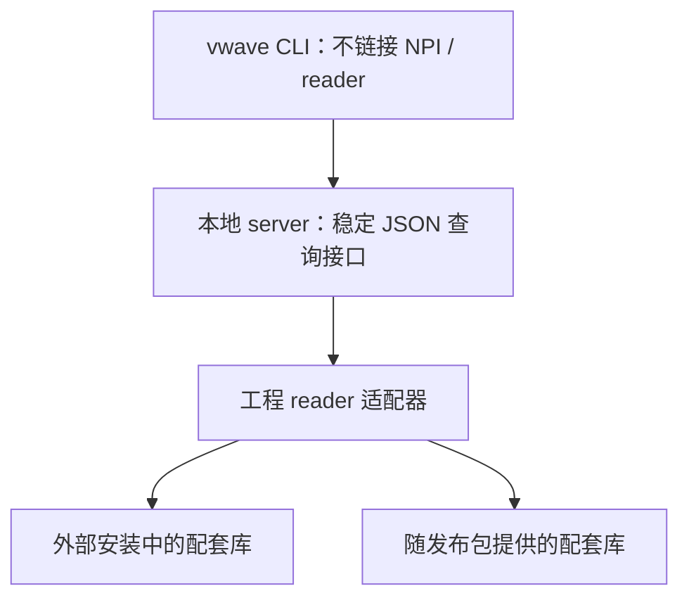

# FSDB reader 兼容方案：跟随 EDA 的动态加载与自包含发布

日期：2026-10-09

Git 检查点：`f480c57`。本计划已按用户最新要求修订：主要使用配套 reader，重点解决切换 EDA 时的库选择和部署方式。

后续决策：用户已选定动态加载，同时要求保留 NPI、通过参数切换。具体实施以 [双后端开发计划](07_vwave_dual_backend_dev_plan.md) 为准。下文保留两种发布方式的比较；其中 `auto/external/bundled` 是比较阶段的拟议参数，不作为本轮实施接口。

## 1. 结论

建议提供两种模式，共用一套查询接口：

- **动态模式**：使用用户当前选择的 Verdi / FsdbReader 安装中的配套库，适合经常切换 EDA 的环境。
- **自包含模式**：随工具提供固定版本 reader 和支持库，适合没有完整 EDA 安装、需要固定部署的环境。

默认可以采用 `auto`：显式配置优先，其次使用当前 `VERDI_HOME`，没有外部安装配置时才选择随包 reader。显式指定的安装不可用时返回原因，不悄悄换成另一个版本。

兼容目标是“相应 EDA / dumper 的波形由配套 reader 读取”，不要求 2022 reader 读取 2026 波形。跨版本读文件属于额外能力，不是第一阶段前提。

## 2. 两种模式的区别

| 项目 | 动态加载用户安装库 | 自包含 reader 发布包 |
|---|---|---|
| reader 来源 | 指定安装目录或当前 `VERDI_HOME` | 工具发布包内的固定 SDK |
| 用户切换 EDA | 新会话按新配置选择配套 reader | 仍使用随包版本；需要明确切换包或模式 |
| 完整 EDA 安装 | 需要相应 reader 库，可以是完整安装中的 SDK | 不需要完整安装 |
| glibc 要求 | 随选中的外部库变化 | 固定且可在发布前完整验证 |
| 支持范围 | 由该安装的 reader 与已验证 ABI 决定 | 由随包 reader 与已验证波形特性决定 |
| 发布体积 | 较小 | 需包含 reader 与支持库 |
| 复现条件 | 记录外部库路径、版本和哈希 | 固定发布包版本和库哈希 |

自包含并不自动等于“所有代码静态链接进单个 ELF”。本机 SDK 提供的是 `.so`；当前可行形式是二进制加配套 `lib/` 目录。若需要单文件交付，可以封装库并在启动时解包，但其 glibc 要求不会消失。

现有实测已经证明：配套 2022 库的探针可在没有完整 Verdi 安装的纯 CentOS 7 容器运行。2026 reader / 支持库要求 GLIBC 2.27 / 2.28，动态模式和自包含模式都不能改变这个要求。

## 3. SDK 切换是否必须重新编译

不能直接把“C++ API”解释为“每个版本都必须编译一个 worker”，也不能假定任意版本 `.so` 都可以交换。应按实际 ABI 兼容范围设计适配器。

本次补充检查发现：

1. 2022 和 2026 的 `ffrAPI.h` 都包含版本化接口类，以及 `ffrGetInterface()` 接口获取机制。
2. 从 `ffrObject` 类体提取的 111 组虚函数声明，两版序列一致。该检查未预处理所有平台宏，也不等于完整 ABI 认证。
3. 同一个按 2022 SDK 编译的探针，在当前主机切换到 2022 / 2026 的配套 `libnffr.so` 和 `libnsys.so`，都成功读取现有样本，全部 JSON 记录一致。
4. `ldd` 记录确认每次实际加载的是所选安装中的两个库；网络跟踪未出现网络调用。

依据：[切换实验证据](../reverse_analysis/evidence/reader_switch/summary.json)、[复现脚本](../reverse_analysis/scripts/test_reader_switch.py)。

这说明一个适配器覆盖这两个 SDK 的已有查询子集有实际依据。后续扩展到全部命令、回调结构和其他 SDK 版本时仍需验证；新增不兼容版本可以增加一个适配器，不必先复制整个 CLI。

本次实验通过运行时库搜索路径切换已链接库，尚未实现 `dlopen` / `dlsym` 加载器。它验证了当前 ABI 子集与库切换的可行性，不代表完整动态加载实现已经完成。

## 4. 统一的程序结构

建议前端不链接厂商库，reader 加载和所有 SDK 对象留在本地 server / worker 中。



两种模式只改变库的来源，不改变 `get`、层次遍历、边沿、计数和 JSON 输出。免 NPI 构建也不调用 `npi_init()`。

动态加载器应处理：

- 将安装路径解析成绝对路径，成套选择 `libnffr.so`、`libnsys.so` 及所需依赖。
- 在 worker 中加载并验证必须的 SDK 入口，再进行文件打开；CLI 自身不承担高版本库依赖。
- 根据已验证的 ABI 配置使用适配器；未知接口不能仅凭同名导出函数就当作完全兼容。
- 保留加载器的原始错误，明确区分库缺失、glibc 不满足、接口缺失和波形不支持。
- 不在同一个长期进程中同时加载多套 reader，也不在对象仍存活时卸载库。

`libnffr.so` 的动态依赖未完整表达其所需支持库，加载时要验证实际解析到的依赖也来自同一安装。不能只替换 libnffr、保留另一版本 libnsys。

若未来某版本需要另一套 ABI 适配器，可由前端选择独立 worker，继续使用相同协议。当前无需先按每个 EDA 版本创建一份完整工具。

## 5. 库选择规则

以下参数为拟议接口，当前主工程尚未实现：

```bash
# 自动使用当前 EDA 环境
vwave open run.fsdb --reader auto

# 显式指定外部 reader 来源
vwave open run.fsdb --reader external --verdi-home /path/to/verdi

# 明确使用随包 reader
vwave open run.fsdb --reader bundled
```

建议选择顺序：

1. 命令行显式指定的模式和目录。
2. 工程配置中明确指定的模式和目录。
3. `auto` 模式下当前 `VERDI_HOME` 指向的外部 SDK。
4. 没有外部来源配置时，使用随包 reader。

外部来源已经明确指定却无法加载时，返回失败，提示相应的系统 / SDK 问题。不要静默回退到随包 reader，否则用户以为使用的是配套库，实际却查询了另一个版本。

SDK 的选择主要跟随 Verdi / FsdbReader 来源，不仅是 `VCS_HOME`。仿真器、实际 dumper 和 reader 安装应分别记录；用户若指定了不同组合，在 info 中如实显示。

自包含也可以提供不同 SDK 的发布包，但每个包应固定一套配套库和系统基线，明确名称与版本。优先从已验证的 CentOS 7 / 2022 组合开始。

## 6. 用户切换 EDA 时，会话应怎样变化

EDA 环境变量变化不会改变已经运行的 server 所加载的库。这个行为需要明确设计，避免界面显示新版本而进程仍使用旧库。

推荐语义：

- 查询继续使用打开时固定的 reader，不因当前 shell 的环境变化而中途切换。
- `status` / `info` 显示该会话实际 reader 来源、SDK 标识和库路径。
- 再次执行 `open` 时重新解析选择规则。如果同一 FSDB 但 reader 身份发生变化，应重启对应 server；不能沿用“同一文件就直接返回已运行”的现有判断。
- `--reader bundled` 的会话不随用户切换 EDA 而变化。
- 同时分析多个环境的文件时，使用独立运行目录和会话，不将多套 SDK 放进同一 server。

会话身份应包含：文件身份、模式、reader 绝对路径、库哈希和适配器版本。`source_info` 目前只记录文件路径，需增加 reader 元信息，并在确认加载成功后发布。

更新 EDA 补丁而路径不变时，库哈希能识别变化。已经加载的进程仍使用自己的会话；下一次 open 检测新身份并重新启动。

## 7. 系统与文件兼容边界

动态加载只解决“选哪套库”，不能降低该库的 glibc 要求。主程序在 CentOS 7 能执行，不代表选中的 2026 worker / reader 也能执行；应在文件加载前返回清晰错误。

自包含固定了依赖和支持范围，便于验证 CentOS 7，但不承诺读任意未来波形。用户需要配套新 reader 时，可以选择动态模式或相应发布包。

波形仍要记录格式版本、实际仿真器 / dumper 和完成状态。匹配 SDK 也需要核对数字信号、总线、glitch、real / string 等所需能力；不能把“打开成功”当作所有查询都通过。

这些检查服务于配套组合的正确性，不将跨年代读取作为必须完成的目标。

## 8. 验证与实施顺序

第一阶段验证库选择和切换，再接入完整查询：

1. 原型加载器支持外部与随包两种来源；确认 CLI 的 ELF 依赖不包含 NPI / reader。
2. 使用 2022 SDK 加载 2022 dumper 样本、2026 SDK 加载 2026 dumper 样本，分别完成所需命令对照。
3. 在新会话之间切换 `VERDI_HOME`，核对实际库映射与输出；验证已打开会话固定 reader，再次 open 才切换。
4. 切换到 bundled，确认不受外部 EDA 环境影响；模拟显式外部路径无效，确认不静默回退。
5. CentOS 7 验证配套 2022 发布包；2026 库在该环境的加载失败要正确报告。
6. 检查库路径未变但哈希变化、多个独立会话以及 reader 初始化失败的清理。
7. 对每个支持的 ABI / SDK 配置完成数字值、层次、范围、边沿与计数对照，再扩展特殊特性。

目前完成的是方案修订和两套 reader 的运行时切换探针。尚未修改主工程 backend、实现 dlopen 加载器或生成 2026 配套测试样本。
