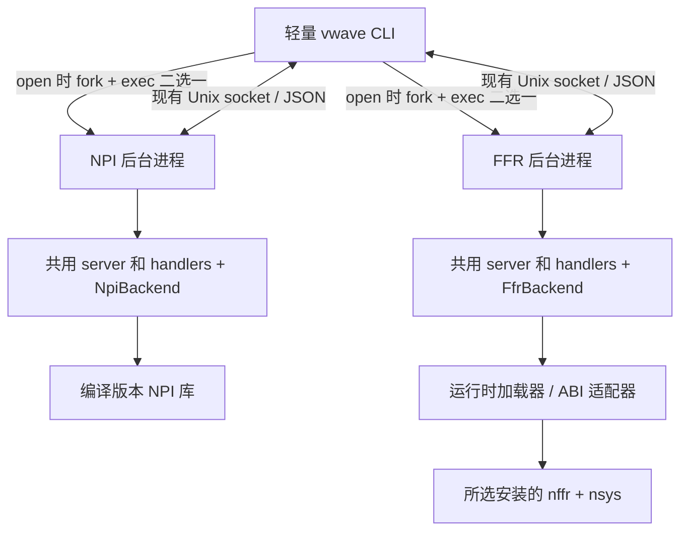

# vwave 双后端开发计划：保留 NPI，动态加载 FsdbReader

日期：2026-10-09

状态：开发评估，尚未实施主工程改造。前期证据见 [兼容方案](06_fsdb_reader_compatibility_plan.md) 和 [reader 实测报告](../reverse_analysis/reports/02_reader_centos7_and_npi_relationship.md)。

## 1. 结论与工作量

方案可行。建议增加 `--backend npi|ffr`：默认 `npi` 保持现有用法，`ffr` 使用当前选择的 Verdi 安装中的配套 FsdbReader。两者共用命令和查询协议。

不能只在现有 `run_server()` 里加分支。目前 `vwave` 前端、server 和 handlers 编译进同一个直接链接 NPI 的 ELF。这样即使选择 ffr，启动也会受 NPI 的运行库和系统版本要求影响。需要先拆出不链接厂商库的 CLI，再把两种读取方式放到各自后台进程。

按一名熟悉本工程的 C++ 开发者估计，普通数字波形的完整命令支持、EDA 切换和 CentOS 7 验证约 **11～17 人日**。real/string 等特殊类型、额外 ABI 适配或较大性能问题可能再增加 **2～4 人日或更多**。先用 1～2 人日完成真正的动态加载原型，再收敛后续估计。

首版目标是配套 reader 读取配套波形。2022、2026 分别验证对应样本，不把旧 reader 读取新年代波形列为必需功能。动态加载不能降低厂商库的 glibc 要求：CentOS 7 先支持已实测的 2022 reader；2026 reader 在该系统上应明确报告不兼容。

## 2. 参数与会话行为

拟议用法如下，当前尚未实现：

```bash
# 原用法保留，默认 NPI
vwave open run.fsdb
vwave open run.fsdb --backend npi

# 从当前 VERDI_HOME 选择配套 FsdbReader
vwave open run.fsdb --backend ffr

# 覆盖当前环境，显式指定 reader 安装
vwave open run.fsdb --backend ffr --verdi-home /path/to/verdi

# 后续查询不需要重复指定模式
vwave get -s tb.clk -t 100000
vwave status --json

# 同一个文件改用另一后端，重启该会话
vwave open run.fsdb --backend npi

# 不同运行目录可同时保留不同后端或 EDA 的会话
vwave open other.fsdb --backend ffr --run-dir /tmp/wave-other
vwave info --run-dir /tmp/wave-other
```

参数规则：

- `open` 未指定 backend 时选择 npi，不引入自动回退。ffr 加载失败不能静默改用 NPI。
- ffr 库来源依次为显式 `--verdi-home`、当前 `VERDI_HOME`。两者都没有时提示配置，不搜索任意安装或沿用编译版本。
- `--verdi-home` 首版只用于 ffr 的 `open`；对 NPI 或查询命令传入该参数时报告参数错误，避免暗示 NPI 已支持任意版本切换。
- 查询、status、close 未指定 backend 时连接已有会话；这里不能套用 open 的默认 npi。若显式给出 backend，只用于核对会话，不触发切换；不匹配时提示重新 open。
- backend 值错误或缺少参数值时立即失败，不能被当前解析器忽略。
- 切换 shell 中的 EDA 环境不影响已打开会话。再次 open 时重新选择库，同文件但模式或库身份变化时重启。

`status` 增加实际 backend、SDK 来源、适配器版本和库指纹；`info` 增加相同来源信息及必要的能力说明。原有字段含义和命令别名保留。

NPI 首版沿用编译时配套版本和现有环境同步逻辑，只把同步放到 NPI 子进程里。用户切换 EDA 后自动选择任意版本 NPI，是另一项开发；本轮动态切换针对 FsdbReader。

## 3. 推荐程序结构



建议交付 `vwave`、`vwave-npi-worker`、`vwave-ffr-worker`。两个 worker 直接承接现有 server，不额外增加常驻调度进程或一层查询转发。源码共用，构建目标分别选择后端。

- CLI 不包含 NPI / FFR 头文件，也不链接对应库，负责参数、会话定位、后台启动及现有查询客户端。
- NPI worker 直接链接现有 NPI 库，维持原初始化、查询和关闭行为。
- FFR worker 运行时加载所选 reader；其自身及工程适配器按 glibc 2.17 基线构建。
- 每个会话只加载一套 SDK。切换采用新进程，不在存活进程内卸载并替换 reader。
- worker 相对 CLI 的安装路径定位，兼容打包后移动目录；缺少 worker 时直接给出部署错误。

这样可避开 `libNPI.so` 内置 ffr 与外部 reader 的符号混用。CentOS 7 上可运行 CLI 和兼容的 FFR worker，即使包里的另一套 NPI worker 依赖较新系统，也不应阻止 ffr 模式启动。

## 4. 第一项技术验证：真正的动态加载

现有探针已经验证同一二进制通过库搜索路径切换 2022 / 2026 配套库，输出一致；**尚未验证 `dlopen/dlsym` 加载器**。两版 111 组虚函数声明序列一致也不是完整 ABI 保证。

FFR 使用 C++ API，除 `ffrObject` 的虚函数外，`ffrVCIterOne` 的取值、时间定位、释放等入口包含普通成员函数。仅解析一个 `ffrOpen3` 入口不足以完成全部查询。

第一阶段需在 `reverse_analysis/` 中完成小原型：

1. 选择 SDK 的绝对目录，成套加载 `libnsys.so`、`libnffr.so`，核对 zlib、dl、pthread 等实际依赖。支持库并非全部由 reader 的 `NEEDED` 自动表达。
2. 验证入口绑定办法。优先评估工程自己的小型 C ABI shim：shim 用 SDK 头文件编译，封装 C++ 调用，再由 FFR worker 动态加载。若直接绑定入口更简单，也必须覆盖实际使用的非虚函数及关闭路径。
3. 若 shim 直接依赖厂商库，必须验证其依赖如何解析到所选安装；可在 exec 前配置子进程库路径并配合绝对路径预加载。不能认为 `dlopen` 一个绝对路径就能保证所有依赖来源正确。
4. 确定必要的 `RTLD_LOCAL/RTLD_GLOBAL` 范围，检查实际库映射，验证没有混入另一版本。环境配置只作用于待启动子进程。
5. 完成打开文件、树回调、加载一个信号、定位时间、前后遍历、释放句柄和关闭文件。检查资源销毁顺序：先句柄和 reader 对象，最后库；正常运行期间保持库加载。
6. 在两个 SDK 上分别验证，并在 CentOS 7 上运行 2022 组合；无效目录、缺少入口、glibc 不足时要保留原始加载错误。

产物是可复现的加载原型、实际入口清单和 ABI 支持表。一个经验证的适配器可以覆盖多个 SDK；未来不兼容版本增加 shim/适配器，无需复制 CLI 或整套 worker。未知版本需完成接口与行为验证后加入支持表，不能按年份或同名符号推断兼容。

## 5. 查询适配与一致性

新增工程内部 `WaveBackend` 接口。厂商句柄、回调数据和值编码留在实现里；共用层只使用文件信息、scope/signal 信息、工程信号标识、时间和值等类型。内部接口按查询能力划分，不逐个照搬全部 NPI API。

先把现有 NPI 调用移到 `NpiBackend`，以当前输出作为基线；再接入 FFR。共同的参数检查、通配符匹配和 JSON 输出可复用，SDK 差异由 backend 处理。NPI 2022 非 ASCII 名字的 workaround 也留在 NPI 实现中。

| 功能 | FFR 适配工作 | 必须对照的行为 |
|---|---|---|
| status / info | 文件元信息、来源与能力 | 时间单位、范围、格式版本、完成状态；缺失元信息不能伪造 |
| scopes / signals / signal-info / find | 树回调建索引，路径对应 idcode | 深度、顺序、compact/full、范围方向、重复 idcode、数组和转义名字 |
| get 点值 / 多信号 | 加载信号、时间定位、值格式转换 | `actual_time`、初值、事件间时间、超出范围、各进制、X/Z、宽总线 |
| get 范围 | 遍历 VC、格式转换、截断 | 起止边界、同时间多事件、`total_changes` 与 `truncated` |
| edge | 前后遍历、目标值判断 | forward/backward、严格边界、rising/falling/any、X/Z 与无结果 |
| vc-count | 计数接口或遍历统计 | 初始记录是否计数、边界、glitch 和重复值 |

尤其要先记录现有 edge 行为：rising/falling 目前基于 NPI 查找目标值，并不能直接假定与 Verilog 的边沿定义相同。首版保持现有命令语义；若发现需要修正的既有行为，单独记录。

范围查询不能因为输出 limit 提前结束，就把 `total_changes` 填成已输出数量。可以边遍历边计数而只保留限额内结果；若 SDK 有计数接口，先验证其边界与输出一致。

FFR 首先支持普通四态数字值及总线，按查询信号加载与缓存，避免一打开就读入全文件全部 VC。real/string、其他值编码或特殊波形类型逐项验证；未支持时给出明确错误，NPI 可继续承担对应查询。

## 6. 会话记录与启动流程

当前 `source_info` 仅存路径，并由公共 `tw::RunDir` 读取。建议保留该文件格式，新增 vwave 专用 `session.json`，避免影响 vsignal。

记录内容包括：元数据版本、backend、FSDB 绝对路径及文件状态、实际 SDK 路径、reader/support 库路径与哈希、适配器版本。NPI 会话记录实际编译配套 SDK，而非当前 shell 中可能已切换的值。

再次 open 比较文件身份、backend 和选定库身份；身份相同才复用。同一路径升级 EDA 补丁也应由库哈希识别。哈希在 open 时计算，查询不重复扫描库。

推荐启动流程：解析并预检候选配置 → 对比已有会话 → 必要时停止旧 worker → exec 所选 worker → 加载与打开成功 → 原子写入会话记录 → socket 就绪 → 父进程确认 readiness。候选库可在一次性子进程中预检，不把厂商库加载进 CLI。

启动失败时返回加载日志和明确错误，清理未完成的 PID/socket/元数据。保留现有超时和后台继续加载的约定。新参数不原样交给 `npi_init`，由 worker 构造需要的 NPI 参数。

旧会话没有 session.json 时按旧 NPI 协议兼容查询和关闭；再次 open 可以受控重建以补齐元信息。元数据不能代替对活跃 server 的 status 核对。

同时修正 `resolve_run_dir()`：目前仅提供 `--run-dir`、未提供 `--fsdb` 时会忽略覆盖目录。这直接影响多会话隔离，属于本次必要改动。

## 7. 改动文件与实施顺序

以下新增路径为建议，实施时可以按工程结构调整。

| 位置 | 改动 |
|---|---|
| `src_vwave/main.cpp` | 新参数、独立 worker 启动、会话身份比较、查询核对；移除 server/NPI 编译依赖 |
| `src_vwave/server/server_core.h` | 使用 backend 初始化和关闭，共用 dispatcher/readiness |
| `src_vwave/server/handlers.h` | 将直接 NPI 调用改为工程接口，保持 JSON 契约 |
| 新增 `src_vwave/backend/` | 接口、NPI/FFR 实现、值转换、动态加载与 ABI 适配 |
| 新增 worker 入口 | 分别构建 NPI / FFR server，构造各自初始化参数 |
| `src_vwave/common/run_dir.h`、新增 session 模块 | session.json、身份核对和专用清理 |
| `src_common/daemon.h` | 复用 fork 后回调执行 exec；只有确有必要才增加公共辅助函数 |
| `Makefile`、打包配置 | 拆分链接参数；打包 worker/工程 shim；提供无需 NPI 的 ffr 构建目标 |
| `test_vwave/` | 参数化后端与临时运行目录，增加差分、切换和失败场景 |
| `README.md`、工程内 vwave 技能文档 | 参数、安装、支持组合和故障提示 |

vsignal 继续使用原 NPI 构建。公共构建参数需拆开，不能因为 vwave 前端去掉 NPI 而破坏 vsignal 的 include/link flags。发布包包含工程自己的 worker/shim，不随包携带厂商 reader；运行时使用用户安装库。

| 阶段 | 工作 | 阶段验收 | 估计 |
|---|---|---|---|
| P0 | 真正动态加载原型、入口与 ABI 表 | 两套库加载与单信号遍历；2022 在 CentOS 7 成功 | 1～2 人日 |
| P1 | CLI/worker 拆分、接口抽取、NPI 迁移 | 原命令及结果不变；CLI 无厂商 ELF 依赖 | 2～3 人日 |
| P2 | FFR 层次、元信息、点值和范围 | 普通数字查询与 NPI 对照通过 | 3～5 人日 |
| P3 | edge/count、会话身份、切换与失败处理 | 命令边界、换模式/换 EDA、多目录会话通过 | 2～3 人日 |
| P4 | 配套版本样本、CentOS 7、部署和文档 | 支持表、系统限制、打包移动运行验收完成 | 3～4 人日 |

P0 是关键判断点。如果一个 ABI 适配器覆盖两套 SDK，就沿用单适配器；若需要分开，先增加两种小 shim，保留同一协议和共用查询层。P1 完成后先验收 NPI，再接入 FFR，便于定位行为差异。

## 8. 验证计划与完成标准

本次仅编写计划，不运行主工程回归。实施时使用以下针对性验证：

1. **NPI 回归**：现有 vwave 命令覆盖改造前后对照，验证默认值、别名、输出和初始化逻辑。现有脚本会吞掉退出码，差分测试需另行检查成功/失败状态并解析 JSON，不能只匹配字符串。
2. **FFR 差分**：同一配套样本分别用 NPI 和 FFR 查询，比较结果内容；PID、uptime 和新来源字段单独检查。补充 X/Z、宽总线、同时间事件、无变化信号、非事件时间和范围边界。
3. **EDA 配套矩阵**：2022 SDK + 2022 dumper 样本，2026 SDK + 2026 dumper 样本。现有样本来自 2022，2026 配套样本尚需生成；当前切库实验不能代替这项验收。
4. **会话切换**：同文件同配置 PID 不变；换 backend、换安装、同路径库升级时重新启动；仅切 shell 环境后查询仍使用旧会话；独立目录可同时查询不同会话。
5. **系统与依赖**：在 glibc 2.17 环境构建并验收 CLI、FFR worker 和 shim 的完整依赖，包括 GLIBCXX/CXXABI。CentOS 7 + 2022 断网运行；切到 2026 库清楚报告 GLIBC 不满足，CLI 仍可使用。
6. **实际加载来源**：核对运行进程映射，reader 与支持库来自选定 SDK；FFR 会话不加载 libNPI、不调用 npi_init。无效 license 环境及网络跟踪用于复验已支持数字样本，无需改用户 shell。
7. **错误与资源**：缺库、缺入口、未知 ABI、不支持的值类型、坏文件、启动超时、退出与重复 open，不留下伪就绪会话。库路径中空格和运行目录切换也要覆盖。
8. **部署与性能**：发布目录移动后 CLI 能定位 worker；仅安装配套 reader 的环境可运行 ffr。选一个较大波形比较打开耗时、点查耗时与内存，重点检查没有全量加载 VC 或每次重建索引。

首版完成标准：NPI 原用法通过；FFR 在已验证 SDK 上支持现有数字查询命令；后台固定所选库且切换可追踪；CentOS 7/2022 可独立运行；加载失败明确可诊断；支持矩阵和未支持特性有记录。

本轮实施范围限于本地双后端、动态 reader 选择和相关兼容性。远程 server/client 分离、自包含厂商库发布、自研 FSDB 文件解码以及任意 NPI 版本动态切换，保留为后续独立任务。
