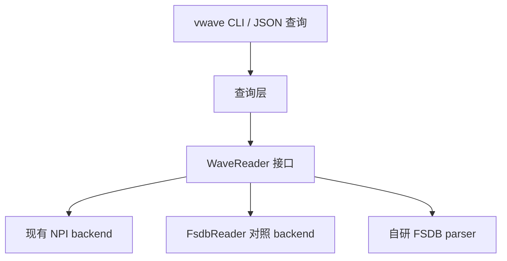

# FSDB 自行解析与本地免 NPI 运行：初步分析

日期：2026-10-09
工程基线：tool_wave v1.6，提交 `0a3a6c9`
分析对象：本机 Verdi Y-2026.03-SP2 的 NPI / FsdbReader，以及现有 `test_vwave/tb_top.fsdb`。

## 1. 结论

**这个方向值得继续，而且当前样本已有一个不经 NPI 的实测读取入口。** 自行实现 FSDB reader 的关键应放在底层格式和解码器上，没必要先逆向整个 NPI 框架。

本次发现独立 FsdbReader SDK，并完成最小实验：探针不链接 NPI、不调用 `npi_init()`，把 License 服务器环境变量设为 `1@127.0.0.1`，仍可读出层次信息、时间范围和 `tb.clk` 的 132 条变化记录。全子进程网络跟踪未出现网络调用。

这证明了**当前 reader 版本与当前样本的读取路径没有依赖可达许可证服务器**。同时，probe 仍然链接厂商的 `libnffr.so` / `libnsys.so`，尚未实现自己的格式解码，也不能把本次结果外推到所有 FSDB 版本和特性。

建议把工作分成两条：

- 将独立 reader 用作结果对照工具，先获得可靠的文件与事件语义。
- 以此对照逐层实现自己的 parser，最终二进制不加载任何 Verdi / NPI / FsdbReader 库。

本次已建立 [逆向工作区](../README.md)，保存可重复执行的脚本、探针、局部反汇编和实际输出。主工程实现未改动。

## 2. 两种目标需要分开验收

| 目标 | 本次结果 | 还需要什么 |
|---|---|---|
| 不使用 NPI 读取 FSDB | 已完成最小验证 | 扩展到 vwave 全部查询行为 |
| 不依赖可达 License 服务器读取当前样本 | reader 探针通过，未观察网络调用 | 多版本、多特性、完整运行条件验证 |
| 不依赖 Verdi 安装与厂商动态库 | 未完成 | 自行实现文件读取、解压、层次和事件解码 |
| 单机本地替代 vwave 的波形查询 | 有明确切入点 | parser 与查询语义对齐、缓存与索引、性能验证 |
| 同时替代 vsignal 的网表追踪 | 本次未涉及 | KDB / RTL 和连接图属于另一项工作 |

FSDB 是波形数据库，不能仅靠信号值变化恢复完整网表驱动、负载和寄存器追踪。因此本次路线解决的是 vwave 的 FSDB 读取依赖；不会自动解除 vsignal 的 NPI 依赖。

独立 parser 也不会自动取消 daemon。数据库仍可加载一次后本地反复查询，是否保留 server 应按性能决定；最终运行不再需要把加载进程放到有许可证的节点上。

## 3. 当前程序究竟需要替代哪些能力

从 `src_vwave/server/handlers.h` 与 `server_core.h` 提取出 30 个不同的 `npi_fsdb_*` API 名称，清单见 [API 调用面](../evidence/static/vwave_npi_api_surface.json)。它们可归为六组：

| 能力 | 当前命令 | 自研 reader 需要提供的内容 |
|---|---|---|
| 文件信息 | `open` / `info` | 版本、时间单位、最小 / 最大时间、完成状态 |
| 层次浏览 | `scopes` / `signals` / `find` | scope 树、信号名、完整路径、查询与遍历 |
| 信号属性 | `signal-info` | 位宽、左右边界、方向、类型 |
| 时间点值 | `get -t` | 找到指定时刻应生效的值，区分实际事件时间与查询时间 |
| 范围值 | `get -b -e` | 解码时间和值序列，按信号和时间窗口返回 |
| 边沿与计数 | `edge` / `vc-count` | 向前 / 向后遍历、上升 / 下降沿语义、变化统计 |

不需要重写 NPI 的网表、事务、UPF 等全部模块。第一版可以限定普通数字信号；real、字符串、结构体、数组、断言、glitch 和多 session 留待后续兼容。

四态值至少要正确保留 `0/1/x/z`。进制转换和信号搜索可以在自己的查询层实现，不必恢复厂商内部对象结构。

## 4. 静态分析发现

### 4.1 NPI open 是上层包装，不是文件格式本体

`libNPI.so` 约 124 MiB，完整符号表仍包含大量可读函数名。本次保存的局部反汇编显示：

```text
npi_fsdb_open(char const*)
  → npi_fsdb_direct_open(...)
  → fda_file_mgr_t::open_file(...)
```

外层 open 有 NPI 全局状态检查，内部涉及文件管理和初始化流程。独立 reader 实验进一步说明：不需要复制这些 NPI 生命周期机制才能读取当前 FSDB 样本。

依据：[NPI open](../evidence/static/npi._Z13npi_fsdb_openPKc.asm.txt)、[内部 open](../evidence/static/npi._Z20npi_fsdb_direct_openPKccb.asm.txt)。

### 4.2 独立 reader 是更小、更直接的分析目标

本机安装位置：

```text
/opt/Synopsys/verdi/Y-2026.03-SP2/share/FsdbReader/
  ffrAPI.h
  fsdbShr.h
  example/
  linux64/libnffr.so
  linux64/libnsys.so
```

`libnffr.so` 约 44 MiB，完整符号表包含下列定位点：

- 文件头：`ffrDisk::ReadHeader()`、`ReadFixedHdr()`、`ReadCloseHdr()`、`ReadFlushHdr()`。
- 层次：`ReadScopeTree()`、`ReadScopeVarTree()`、按需读取树的相关函数。
- 数据块：`GetBlkLayoutByScanBuf()`、`GetOffAndCmpLenByBlkLayout()`、`DecompressBlk()`。
- 数字事件：`BC1_ReadVCOnDemand()`、`BCN_ReadVCOnDemand()`、时钟编码和多种 bus 读取分支。
- 值遍历：`ffrVCIterOne` 的 Goto / XTag / GetVC 系列。

这些名称是可定位的分析入口，不等同于已经还原其数据结构。符号与样本指纹见 [静态证据清单](../evidence/static/manifest.json)、[reader 符号](../evidence/static/reader.symbols.txt)。

需要注意，`libnffr.so` 的 ELF `NEEDED` 没有完整表达应用程序应补上的依赖。实际探针还需链接 `libnsys`、zlib、dl 和 pthread，不能只凭其 `NEEDED` 列表认定 reader 完全独立。

### 4.3 文件头已经有可验证的结构线索

现有样本大小为 23092 字节，SHA-256：

```text
20cfd9439699ef49e135b5bb50e4961dfaf796d322838fb71f888ad719a50a3d
```

| 样本文件偏移 | 观察 | 当前判断 |
|---|---|---|
| `0x04` | `1c 3e d9 48` | 候选格式标识；还需从识别函数与不同样本确认 |
| `0x08` | `04 03 02 01` | 与 reader 中 `0x01020304` 字节序处理逻辑对应 |
| `0x3c` | 字节值 `04` | `ReadFixedHdr()` 用该字段 × 256 控制固定头读取长度；本样本对应 1024 字节 |
| `0x4c` | ASCII `1ps` | 时间单位，与 reader 返回值一致 |
| `0x60` | 生成日期文本 | 可见元信息 |
| `0x80` | VCS T-2022.06-SP2 文本 | 样本生成器信息 |

`ReadFixedHdr()` 先从文件起点读 `0xc0` 字节，再按 `0x3c` 字段读取扩展部分；`ReadHeader()` 依次调用固定头、关闭头、flush 头和扩展关闭头读取函数。可以先恢复这些字段与文件布局，再定位层次和事件块。

这里的判断来自文件字节和局部反汇编交叉观察。C++ 对象中的 `0x400`、`0x800` 等成员偏移不能直接当作 FSDB 文件块地址。依据见 [文件头字节](../evidence/static/sample_head.hex.txt)、[固定头读取](../evidence/static/reader._Z12ReadFixedHdriiP12fsdbFixedHdr.asm.txt)。

样本包含可见日期、生成器和部分层次名称，也有明显非文本区域。ASCII 搜索只能提供线索，不能恢复完整层次树；信息熵也不能单独证明某区域采用哪种压缩或加密。

### 4.4 难点在压缩、事件编码和索引

`DecompressBlk()` 的局部反汇编包含：

```text
块布局与长度查询 → wrap_pread
                 → 部分条件分支中的 AES_cbc_encrypt
                 → ffCmpSetMethod / ffCmpSetDoubleCmp
                 → ffCmpDecompress
```

依据：[块解压路径](../evidence/static/reader._ZN7ffrDisk13DecompressBlkEP10ffrScanBuf.asm.txt)。

由此可知 reader 有压缩方法分派、可能的二次压缩以及加密相关分支，但本次尚未确认当前样本实际走哪一个分支。**不能直接假定 FSDB 全部是 zlib，也不能因为看到 AES 调用就认定所有文件都加密。**

另外，头文件定义的 API 返回值编码 `0/1/2/3 → 0/1/x/z` 是解码后的表示；磁盘上可能采用位打包、bus 编码、时间差分或特殊时钟表示，需要单独验证。

## 5. 已完成的最小读取实验

实验源文件：[reader_probe.cpp](../probes/reader_probe.cpp)。可重复命令见 [run_reader_probe.sh](../scripts/run_reader_probe.sh)。

条件：

- 编译仅链接 reader 与支持库，不链接 `libNPI` 或 `libnpiL1`。
- 不调用 `npi_init()`，直接执行 `ffrOpen3()`、树回调、信号加载与事件遍历。
- 在实验子进程中设置 `SNPSLMD_LICENSE_FILE=1@127.0.0.1`、`LM_LICENSE_FILE=1@127.0.0.1`。
- `strace -f -e trace=network` 跟踪全部子进程，20 秒实验截止时间。

| 项目 | 实际结果 |
|---|---|
| 时间单位 | `1ps` |
| 文件时间范围 | `0` ～ `3275000` |
| scope 回调数 | 235 |
| variable 记录数 | 13382，包含层次与可能的别名，不代表唯一波形序列数 |
| 目标信号 | `tb.clk`，idcode 为 1，位宽为 1 |
| 事件数 | 132，未达到探针输出上限 |
| 事件时间间隔 | 全部为 25000 |
| 值 | 从 `0` 开始，`0/1` 交替 |
| 网络调用 | 跟踪中未出现 socket / connect 等网络调用 |
| 退出状态 | 0 |

输出开头：

```json
{"type":"event","time":0,"value":"0"}
{"type":"event","time":25000,"value":"1"}
{"type":"event","time":50000,"value":"0"}
```

时间范围、单位和时钟变化数与现有 vwave 测试脚本中的预期一致。此次未运行新的 NPI 查询，尚未进行逐事件完整对照。

原始证据：[实验条件](../evidence/probe/test_conditions.txt)、[解析结果](../evidence/probe/reader.jsonl)、[网络跟踪](../evidence/probe/network.strace.txt)、[探针 ELF](../evidence/probe/probe.elf.txt)。

这个结果使独立 reader 成为一个可用的格式对照工具，也提供了一个可能较快的免 NPI backend 方案。但若目标是“完全自己实现”，最终验收必须使用自己的解码器，并在没有厂商库的环境中通过。

## 6. 自行解析的建议顺序

### 6.1 先建立可控样本，不直接啃现有复杂波形

现有样本虽只有约 23 KiB，reader 却返回上万条 variable 记录，包含接口、时钟块及验证相关对象。它适合后续回归，不适合单独用来推导每一种编码。

下一阶段先生成少量、单变量受控的 FSDB，并同时输出 VCD 或保存已知事件表：

| 样本 | 只改变的变量 | 要回答的问题 |
|---|---|---|
| 单 bit 常量 | 0 / 1 / x / z | 初始值和四态编码 |
| 单 bit 跳变 | 时间与跳变次数 | 时间单位、时间差分、终止记录 |
| 单 bit 非周期跳变 | 不规则时间间隔 | 避免只还原了特殊时钟压缩路径 |
| 2 / 8 / 32 / 64 bit 总线 | 位宽与固定值 | bus 编码、位序和跨字节布局 |
| 两个同值信号与别名 | 名字、共享关系 | idcode 分配与别名 |
| 两级层次 | scope / signal 名称与长度 | 名称压缩和层次记录 |
| 大时间戳 | 超过 32 bit 的时间 | 时间宽度与溢出边界 |
| 多块数据 | 事件量跨越块边界 | 块目录、索引和随机读取 |
| 两种写入器版本 | 仅版本变化 | 版本兼容与可拒绝的未知特性 |

暂未生成这些样本，现阶段语料只有现有 FSDB。每个样本需保存生成源码、工具版本、FSDB 哈希和独立预期结果；不能只保留二进制。

### 6.2 先恢复文件布局，再恢复事件

建议每阶段交付一个可验证结果：

1. **固定头与块目录**：不用厂商库读出版本、时间单位、区段位置；对偏移、长度、文件边界做检查。
2. **一个压缩分支**：定位受控样本实际使用的方法，在自研代码中解出一个块，并验证长度与内容。
3. **层次树与信号表**：恢复 scope、名称、idcode、位宽和别名映射。
4. **单 bit 完整事件流**：同时覆盖规则与非规则跳变、四态值、大时间戳、跨块情况。
5. **普通总线事件**：验证左右边界、位序、值打包和范围查询。
6. **查询与接入**：实现 vwave 所需时间点 / 范围 / 边沿 / 计数语义，再接到现有 CLI。

每阶段都与 reader 对照，再和生成时的预期事件或 VCD 交叉检查。遇到未支持的版本或编码应明确拒绝，不能输出猜测值。

### 6.3 先抽象波形 backend，再替换依赖

当前 handler 直接操作 NPI handle。后续建议建立工程自有的 `WaveReader` 接口，只表达文件信息、层次、信号属性和事件迭代。



可以先用 reader backend 对齐语义，再切换到自己的 parser。三种 backend 的数据结构不要暴露厂商 handle，使查询与格式解码能够独立验证。原 NPI backend 的保留也应是构建选项；不能因统一链接而让自研版本继续依赖 NPI 库。

## 7. 工作量判断与关键验收点

复用 reader SDK 实现免 NPI 查询，工作主要在接口适配和查询语义。完全自行实现 parser，则是一项独立格式工程：头部比较容易入手，块解压、层次压缩、事件编码、别名与索引会占主要工作量。

目前只有一个旧写入器样本，不能可靠估算覆盖常见版本所需时间。应该先以“自研代码正确读出受控小样本的完整事件”作为继续扩展的判断点，不以能识别文件头作为解析成功。

最终“独立本地 reader”的验收至少包含：

- 没有 Verdi、NPI、FsdbReader 动态库的环境中运行，ELF 依赖与运行跟踪均不加载它们。
- 不使用 License 服务器，不经转换工具在查询时隐式调用厂商程序。
- 受控样本逐信号、逐事件对照通过，支持 `0/1/x/z`、总线、64 bit 时间及多块。
- 时间点对齐、范围边界、边沿搜索和变化计数与现有查询行为明确对齐。
- 截断、损坏、未知编码有明确错误；压缩输出、长度和索引有边界检查。
- 真实大文件保持按需加载，记录加载时间、峰值内存和查询延迟；小样本通过不代表性能已达标。

## 8. 当前交付与下一步

本次完成了可行性分析、静态取证和独立 reader 最小读取实验，没有修改 NPI 或 reader 二进制，也没有实现自研事件解码器。

下一步优先建立最小 FSDB / VCD 对照样本，继续分析 `ReadFixedHdr()`、块目录和 `ffCmpDecompress` 的实际方法分派。先打通一个普通数字信号的端到端解析，再决定扩大格式覆盖，或将独立 reader backend 作为较快可用的过渡实现。
