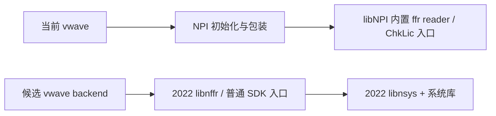

# 独立 FsdbReader 的 CentOS 7 可用性与 NPI 底层关系

日期：2026-10-09
范围：本机 T-2022.06-SP2 / Y-2026.03-SP2 的 `linux64/libnffr.so`、`libnsys.so`，及 2026 版 NPI 普通 FSDB 打开路径。

## 1. 结论

**复用独立 reader 库是可行的候选方案，当前应选择匹配的 2022 版 SDK。** 已在纯 CentOS 7.9 / glibc 2.17 容器中，以关闭网络、不可用 License 地址、没有完整 Verdi 安装的条件，成功读取现有 FSDB 样本的全部 132 条时钟事件。

2026 版 reader 不能直接在 CentOS 7 使用：`libnffr.so` 要求最高 GLIBC 2.27，配套 `libnsys.so` 要求 GLIBC 2.28。实际加载也因缺少版本符号而失败。

**NPI 底层确实使用 ffr reader 这套实现，但当前不是动态调用独立的 `libnffr.so`。** `libNPI.so` 内部包含 ffrObject / ffrDisk 代码，NPI 的文件管理层直接调用其内部的带 License 检查入口。独立 SDK 探针使用普通 `ffrOpen3()` 入口，本次读取没有依赖可达 License 服务器。

因此应给 vwave 增加一个直接链接独立 reader 的 backend；不必先完整逆向 FSDB，也不能靠替换外部 reader `.so` 让现有 NPI 路径免许可证。

## 2. glibc 要求：不能只检查一个 `.so`

CentOS 7 的标准 glibc 为 2.17。通过 ELF 中的未定义动态符号及版本需求，得到以下结果：

| SDK 目录版本 | 库 | 最高 GLIBC 要求 | CentOS 7 实测 |
|---|---|---|---|
| T-2022.06-SP2 | `libnffr.so` | 2.17 | 成功读取 |
| T-2022.06-SP2 | `libnsys.so` | 2.17 | 与 reader 一起成功加载 |
| Y-2026.03-SP2 | `libnffr.so` | 2.27 | 加载失败 |
| Y-2026.03-SP2 | `libnsys.so` | 2.28 | 加载失败 |

2026 版阻止兼容的部分符号：

| 库 | 导入符号 | 要求 |
|---|---|---|
| `libnffr.so` | `__cxa_thread_atexit_impl` | GLIBC 2.18 |
| `libnffr.so` | `getentropy` | GLIBC 2.25 |
| `libnffr.so` | `strtof128`、`strfromf128` | GLIBC 2.26 |
| `libnffr.so` | `glob64`、`logf` | GLIBC 2.27 |
| `libnsys.so` | `getentropy` | GLIBC 2.25 |
| `libnsys.so` | `fcntl64` | GLIBC 2.28 |

这些是加载器解析的真实 ABI 要求，修改 `LD_LIBRARY_PATH` 或移除 NPI 依赖并不能消除它们。此次没有修改系统 glibc 或厂商库。

库的 SHA-256、所需版本、阻止兼容的符号和 `NEEDED` 信息都保存在 [兼容性摘要](../evidence/compatibility/summary.json)，可用 [分析脚本](../scripts/analyze_reader_compat.py) 重新采集。

## 3. CentOS 7 实测

### 3.1 构建和运行条件

- 在本机已有的 manylinux2014 容器中构建：CentOS 7.9，glibc 2.17，GCC 10.2.1。
- 使用 2022 SDK 头文件、`libnffr.so` 和 `libnsys.so`。
- 探针静态链接 libstdc++ / libgcc，避免要求目标机安装较新 C++ 运行库；glibc 仍使用目标机原生版本。
- 使用纯 `centos:7` 镜像运行，目标运行环境没有编译器，也没有完整 Verdi 安装。
- 仅挂载探针目录、FsdbReader 的 `linux64` 目录和样本；挂载均为只读。
- `docker --network none`，两个 License 环境变量设为 `1@127.0.0.1`。

探针自身最高要求 GLIBC 2.14；`NEEDED` 不含 libstdc++、libgcc_s、NPI 或 npiL1。部署时仍需要 reader 的两个库，以及 CentOS 7 自带的 zlib、dl、pthread、libm 和 libc。

容器验证的是 CentOS 7 用户态与动态加载器兼容性，容器内核由宿主机提供；这次没有运行完整 vwave 或验证全部 FSDB 特性。

### 3.2 成功结果

| 项目 | 2022 reader / CentOS 7 |
|---|---|
| 系统 | CentOS Linux 7.9.2009 |
| glibc | 2.17 |
| reader 加载路径 | `/app/lib/libnffr.so` |
| 支持库加载路径 | `/app/lib/libnsys.so` |
| 时间单位 | 1ps |
| 文件时间范围 | 0 ～ 3275000 |
| scope 记录 | 235 |
| variable 记录 | 13382 |
| `tb.clk` 事件 | 132 |
| 与此前 2026 reader 输出比较 | 全部 JSON 记录相同，包括每条事件的时间和值 |
| 退出码 | 0 |

这里的比较是 2022 reader 对 2026 reader，不是对 NPI 新运行结果的比较。

证据：[运行输出](../evidence/centos7/T-2022.06-SP2/runtime.stdout.txt)、[事件 JSON](../evidence/centos7/T-2022.06-SP2/reader.jsonl)、[探针 ELF](../evidence/centos7/T-2022.06-SP2/probe.elf.txt)、[验收摘要](../evidence/centos7/validation.json)。

### 3.3 2026 reader 的负例

将同一个已兼容 glibc 2.17 的探针，配上 2026 版的两个库，在同一个 CentOS 7 运行环境中启动。加载器报告：

```text
libm.so.6: GLIBC_2.27 not found       (required by libnffr.so)
libc.so.6: GLIBC_2.18/2.25/2.26/2.27 not found (required by libnffr.so)
libc.so.6: GLIBC_2.25/2.28 not found  (required by libnsys.so)
```

程序在进入读取逻辑前退出，返回 1。复用同一探针用于隔离库自身的加载要求，不代表两版本 SDK 的对象布局或全部 API ABI 可以互换。

依据：[加载失败记录](../evidence/centos7/Y-2026.03-SP2/runtime.stderr.txt)。

## 4. NPI 是否调用这个 reader

需要区分“使用同一套底层 reader 接口”和“运行时加载这一个独立 `.so`”。

### 4.1 当前调用链已经追到 ffr

局部反汇编显示：

```text
npi_fsdb_open()
  → npi_fsdb_direct_open()
  → fda_file_mgr_t::open_file()
  → fda_file_mgr_t::open_file_with_ffr()
  → ffrObject::ffrOpen3ChkLic() 或 ffrOpenNonSharedObjChkLic()
  → 内部 ffr reader 实现
```

不同条件分支选择共享 / 非共享对象和相关打开选项，不能把某一条分支当作所有文件的唯一路径。但普通 FSDB 分支确实进入 ffr 接口。

`open_file_with_ffr()` 中可见直接调用地址 `0x3d75958`，对应 `libNPI.so` 内部的 `ffrObject::ffrOpen3ChkLic()`。它还含针对特定文件类型的 License 分支；这些并不等于独立 SDK 的普通数字波形读入必然要求同样的 feature。

依据：[open_file](../evidence/compatibility/npi.open_file.asm.txt)、[open_file_with_ffr](../evidence/compatibility/npi.open_file_with_ffr.asm.txt)。

### 4.2 实现内置于 libNPI，而非外部动态导入

三组证据相互吻合：

1. `libNPI.so` 的 `NEEDED` 不包含 `libnffr.so` / `libnsys.so`。仅凭这一点还不能排除 dlopen，因此继续检查调用目标。
2. NPI 的完整符号表中，ffrObject、ffrDisk、ReadFixedHdr 等是本地定义符号 `t`，代码地址属于 NPI 本身。
3. 从 NPI 包装层到这些函数的 call 是指向同一 ELF 内部地址的直接调用，没有经过外部 `libnffr` 的导入入口。

例如：

| 函数 | 独立 reader 中 | NPI 中 |
|---|---|---|
| `ffrObject::ffrOpen3()` | `libnffr.so`，导出符号 `T`，地址 `0x865268` | `libNPI.so`，本地符号 `t`，地址 `0x3d75730` |
| `ffrDisk::ReadHeader()` | reader 中有实现 | NPI 中有另一份内部实现 |
| `ReadFixedHdr()` | reader 中有实现 | NPI 中有同名内部实现，大小同为 `0x12e` |

这足以确认当前已分析的 FSDB 路径使用 NPI 内置的 reader 代码。更准确的表述是“同一套 ffr 底层实现体系，分别包含在两个库中”；此次未证明全部函数源码与构建参数完全一致，也未穷尽所有插件路径。

依据：[NPI 动态依赖](../evidence/compatibility/npi.dynamic.txt)、[内置 ffrOpen3](../evidence/compatibility/npi.ffr_open3.asm.txt)、[内置固定头读取](../evidence/compatibility/npi.reader_fixed_header.asm.txt)。

### 4.3 为什么独立 reader 能读，现有 NPI 仍需许可证

现有 vwave 先执行 `npi_init()`，NPI 生命周期本身有许可证签出；文件打开包装还使用 ChkLic 版本的 reader 入口。独立探针没有调用这些 NPI 入口，而是直接调用 SDK 公开的普通 `ffrOpen3()`。

本次实验没有改任何 License 检查或库代码，使用的是现有 SDK 的公开读取接口。因此可用的工程方案是绕开整个 NPI backend，直接使用独立 reader，而不是通过替换库文件改变 NPI 的行为。



## 5. 推荐的工程方案

优先做 `FsdbReader` backend，不再将完整自研 parser 作为解除许可证依赖的前置条件：

1. 固定使用已验证的 2022 SDK 头文件、`libnffr.so`、`libnsys.so`，以文件哈希识别具体版本；不混用两版本库。
2. 把 scope / signal 映射、事件读取封装成工程自己的 reader 接口，保留现有命令和 JSON 查询行为。
3. 在 glibc 2.17 的构建环境生成发布二进制，静态链接 C++ 运行库或明确配套所需版本；仅在较新机器编译并不能保证兼容 CentOS 7。
4. 采用相邻 `lib/` 目录和 `$ORIGIN/lib`，避免依赖本机 `/opt/Synopsys/verdi` 的绝对安装位置。
5. 完成全部波形查询与真实文件验证后，去掉该构建的 NPI / npiL1 依赖；主工程当前尚未切换。

可部署的布局为：

```text
vwave
lib/
  libnffr.so
  libnsys.so
```

当前 probe 已按这个加载布局在 CentOS 7 验证。系统库由目标系统提供，不需要携带或替换目标机 glibc。

这里的“无需许可证服务器”是运行行为的验证结果。本次只验证了当前普通数字样本；新写入器格式、加密文件、事务、real / string、glitch、特殊压缩等仍需按实际需求补测。特别是若主要输入来自新版本仿真器，必须确认 2022 reader 能读这些实际文件，再选为固定 backend。

vsignal 的 KDB / RTL 网表分析与本次方案无关，仍需单独处理。

## 6. 本次交付

- 新增 [ABI 与调用关系分析脚本](../scripts/analyze_reader_compat.py)。
- 新增 [CentOS 7 验证脚本](../scripts/test_centos7_reader.sh)，构建和运行均关闭网络。
- 保存两版本 ABI 要求、NPI 内部调用链、镜像指纹、成功 / 失败日志与逐事件结果对照。

当前建议是继续实现 2022 FsdbReader backend。已有实测表明它能满足当前样本的单机读取与 CentOS 7 用户态要求，成本明显低于完整重写 FSDB 解码器。
